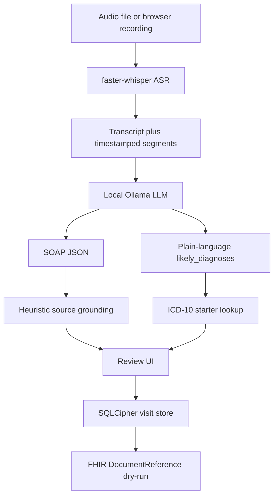

# Offline Scribe

Offline Scribe is a local-first clinical AI documentation prototype that converts synthetic clinician–patient conversations into structured SOAP notes using automatic speech recognition and locally hosted large language models.

It is a **research and engineering prototype**, not a clinical product. It is not FDA-cleared, not clinically validated, and not a diagnosis or coding system. Notes are drafts for a human reviewer. Evaluation used **synthetic / mock** dialogues and TTS audio, not real patients.

**Author:** Zorykto Mykola. This is a personal project: I defined the problem, architecture, evaluation, and the reliability work below. AI coding assistants were used as development tools. They are not authors, owners, or contributors.

The API binds to `127.0.0.1` only. Visit audio and notes are not sent to a cloud model at inference time. Live FHIR POST to Oracle Health is **disabled**; dry-run JSON can be printed locally.

---

## Contents

- [Research / engineering motivation](#research--engineering-motivation)
- [System architecture](#system-architecture)
- [Technical implementation](#technical-implementation)
- [AI reliability engineering](#ai-reliability-engineering)
- [Evaluation methodology](#evaluation-methodology)
- [Results](#results)
- [Failure-mode analysis](#failure-mode-analysis)
- [Iterative development](#iterative-development)
- [Reproducibility](#reproducibility)
- [Demo Mode](#demo-mode)
- [Limitations](#limitations)
- [Current state](#current-state)
- [Safety / privacy](#safety--privacy)
- [What I learned](#what-i-learned)
- [Future work](#future-work)

Detailed run tables: [docs/evaluation.md](docs/evaluation.md).

---

## Research / engineering motivation

The interesting question is not “can an LLM emit SOAP-shaped text?” It can. The question this project is built around is:

**How can a documentation system produce structured clinical notes that a person can actually review—tied to source speech, testable when prompts or models change, and honest when the model is guessing?**

That question pushed the work away from a single generate-and-trust demo and toward:

- **Source grounding** — attach timestamped transcript spans to SOAP sections, or mark the section when a link is not confident
- **Hallucination checks** — prompt constraints plus regression tests for a known fabricated claim (“well controlled” on medications that were never described that way)
- **Reference-based coding** — the model names a diagnosis in plain language; a local CMS-derived starter file supplies codes, or returns unmatched
- **Human review** — the UI is a review/edit loop; sync is skipped until a named provider id + timestamp is recorded and FHIR chart ids exist
- **Failure-mode analysis** — grounding wipes, wrong citations, ASR error propagation, negation errors, ICD instability, run-to-run variance
- **Reproducibility** — pinned Python 3.12, `.env.example`, pytest with Ollama mocked, documented hardware-specific timings that are *not* treated as general performance

This is applied AI engineering with an evaluation loop. It is **not** claimed as a novel research contribution or a publication-level result.

---

## System architecture

Components below exist in this repository. Speaker diarization, live EHR write, and RPMS integration do **not**.



**Implemented path:** upload or record audio → `asr_service.py` (`faster-whisper`) → `generate_note()` (`note_service.py` + Ollama or stub) → `apply_grounding()` → `lookup_diagnoses()` → FastAPI `Visit` → SQLCipher → React review UI.

**Present but not live:** `fhir_mapper.py` builds a DocumentReference; `fhir_client.py` refuses live token/POST; `rpms_adapter.py` is a documented stub.

```
backend/app/
  main.py             FastAPI, loopback only
  asr_service.py      Audio → transcript + segments
  note_service.py     Transcript → SOAP (Ollama or stub)
  prompts.py          SOAP system/user prompts
  grounding.py        Section text ↔ transcript spans
  negation_check.py   Flag (do not rewrite) question/denial-as-assertion
  asr_flags.py        Flag low-confidence / odd medication-like ASR tokens
  icd10_lookup.py     Phrase → starter-set code or UNMATCHED
  data/icd10_starter.json
  startup_checks.py   Loopback bind + required secrets + leftover-dev flags
  storage_service.py  SQLCipher visits + review audit + retention purge
  sync_service.py     Dry-run / skipped live POST
  ehr/                FHIR map + disabled client + RPMS stub
desktop-app/          React + Vite UI; optional Tauri shell
audio_samples/        Synthetic dialogue scripts + short ASR fixture wav
backend/tests/       pytest (Ollama mocked unless RUN_OLLAMA_LIVE=1)
```

---

## Technical implementation

### Speech recognition

On-device **faster-whisper** (CTranslate2). The model is loaded once at API startup when `ASR_PRELOAD` is true (tests set it false).

| Setting | Default in `config.py` |
| --- | --- |
| `ASR_MODEL_SIZE` | `small.en` |
| `ASR_DEVICE` | `cpu` |
| `WHISPER_COMPUTE_TYPE` | `int8` |
| `language` | `en` |
| Cache directory | `backend/data/whisper-models/` (gitignored) |

Non-WAV uploads (WebM/MP4 from the browser recorder, etc.) are converted with **ffmpeg** to 16 kHz mono PCM. WAV is passed through. Upload size default is 100 MiB.

Segments include `start_s`, `end_s`, and `text`. `speaker` is always `"unknown"`: faster-whisper does not provide diarization here. That limitation is explicit in `asr_service.py`.

Pytest uses **`tiny.en`**, not `small.en`, so the suite stays fast. The application default remains `small.en`.

### Local LLM inference

SOAP drafting uses **Ollama** at `http://127.0.0.1:11434` (`POST /api/generate`, `format: json`, `stream: false`).

| Item | What the repo actually does |
| --- | --- |
| Config default | `OLLAMA_MODEL=llama3.1:8b` in `.env.example` / `config.py` |
| Evaluation model | `llama3:8b` — `llama3.1:8b` was ~0.09 tok/s on an 8GB CPU Mac and timed out |
| Temperature | `options.temperature = 0.2` on the note-generation call only |
| Stub path | `STUB_MODE=true` returns a canned note (default for tests) |
| Timeout | `OLLAMA_TIMEOUT_SECONDS` default **120**; longer CPU runs need this raised |

Temperature 0.2 is intentional: clinical drafts should prefer consistency over variation. Literal `0` is avoided because some local models behave oddly at zero. **This does not make output deterministic.**

If segments exist, the prompt contains **timestamped segments only**, not a second copy of the full transcript (local 8B context is small).

### Prompting

Prompts live in `backend/app/prompts.py`, not inline in the service.

The system prompt requires: state only what is in the transcript; omit unmentioned details (medication control, allergies); omit when uncertain; do not emit ICD-10 codes; name likely diagnoses in plain language; return JSON matching the schema.

The user prompt asks for:

- `subjective`, `objective`, `assessment`, `plan` (strings)
- `likely_diagnoses` (plain language)
- `follow_up` (`text`, optional `timeframe`)
- `citations` (optional timestamp ranges per section)

ICD codes in the model JSON are **ignored**. Codes come only from lookup.

### Structured clinical documentation

A `Note` has SOAP strings plus `suggested_icd10`, `follow_up`, and per-section `GroundedSection` metadata. Empty discussion is supposed to be `"Not documented in visit"`.

The UI (`NoteReview.tsx`) lets a reviewer edit SOAP text, accept/reject suggested codes, and save. Saving requires a named `reviewer_id` and writes `provider_review` (id + timestamp). A boolean “reviewed” flag is not accepted. Sync and FHIR dry-run skip visits without that attestation. Suggested ICD-10 codes stay unaccepted and are labeled “AI-suggested, unverified” until a person accepts them.

### Source grounding

`grounding.py` never blanks non-empty model text.

1. If the model supplied citation ranges, keep overlapping segments that also pass token overlap.
2. Otherwise score transcript segments with normalized word overlap (pronoun / “patient” normalization, whole-word tokens, short-sentence fallback).
3. Drop family-history segments unless the claim is itself family history.
4. Keep near-best scores in a ~25 s window; far-apart weak topical hits are not cited.
5. If nothing links: keep the text, `directly_stated=False`, empty sources. The UI shows **Sources unclear** vs **Not directly stated** when some quotes exist but the section is not fully supported.

Logs record section name and match counts only—not transcript or note bodies (`test_logging.py`).

This is **heuristic keyword/overlap matching**, not embeddings or NLI.

### ICD-10

`backend/app/data/icd10_starter.json` holds **42** code/description pairs copied from CMS ICD-10-CM FY 2026 tabular descriptions (public CMS files). It is a starter set, not a coding encyclopedia. **J40.0 is not in the file** (J40 is bronchitis).

`lookup_diagnoses()`:

- Ignores strings that look like recalled codes (e.g. `J40.0`)
- Scores aliases / overlap against the starter set
- Returns `UNMATCHED` / “No matching code found — manual coding needed” if nothing clears the threshold

Suggested codes in the UI are **not** diagnoses. `accepted` stays unset until a person reviews them.

---

## AI reliability engineering

Generated text is treated as **untrusted until evaluated**. Concrete issues this repo is built to expose:

| Issue | How it shows up here |
| --- | --- |
| Hallucination | Model wrote “well controlled” for meds the transcript did not describe that way |
| Unsupported claims | Grounding marks unclear sources instead of deleting the sentence (after a wipe bug) |
| Source attribution | Family history and grocery-store BP cited for the wrong SOAP section |
| Paraphrase | First-person vs “patient” missed links until token normalization |
| Negation | Ambiguous-visit run stated fever / SOB that were asked and not confirmed |
| ASR propagation | “lisinopril” → “liz in April” flowed into the note |
| Coding instability | Same transcript → R51.9, then S93.401A, then UNMATCHED |
| Run-to-run variance | Temperature 0.2 reduced Assessment wording drift; ICD still jumped |
| Regressions | pytest mocks Ollama; fabrication and grounding cases are unit-tested |

Ollama self-citations were tried and **not trusted**: empty or weak ranges fall back to overlap matching, which is also imperfect.

---

## Evaluation methodology

Four synthetic encounters (written scripts → TTS). Automated tests plus a small number of live `llama3:8b` runs. See [docs/evaluation.md](docs/evaluation.md) for the full tables.

Included:

- ASR timing/RTF on one ~2:42 sample with `small.en`
- SOAP generation with `STUB_MODE=false`
- Repeated **identical** ambiguous transcript at temperature 0.2 (n=3)
- Grounding checks (wipe, family history, incidental vitals, paraphrase) in pytest
- ICD lookup checks (J06.9 vs J40.0; unmatched unknown phrases)
- Logging checks that transcript/note bodies are not logged
- Single-machine latency (not a benchmark)

Not included: real patients, multi-site tests, blinded clinician scoring, full ICD-10-CM, or GPU numbers. A planted-error harness is committed (`make eval`); it is a blind-spot measurement, not a labeled clinical eval.

---

## Results

**pytest** (this checkout, `backend/`): **65 passed, 1 skipped** in the main suite (`pytest`, eval marker excluded). The skip is `test_live_ollama_returns_structured_note` unless `RUN_OLLAMA_LIVE=1`. Planted-error harness: `pytest -m eval -o addopts=` (**1 passed**). Frontend review-gate tests: `cd desktop-app && npm test` (**4 passed**).

### Successful results

- Loopback API, API key on non-health routes, `/docs` disabled
- On-device ASR with timestamps; ffmpeg conversion path for browser recordings
- SQLCipher storage; DB file is not plaintext SQL in tests
- Stub notes without Ollama; actionable errors if Ollama is down or the model is missing
- Prompt forbids inference and ICD recall (unit-tested)
- Viral URI phrase → **J06.9**, not bronchitis / J40.0; recalled `J40.0` ignored
- Grounding no longer deletes non-empty SOAP text
- Family-history and far-apart BP mentions are filtered in unit tests
- First-person vs “patient” paraphrase can still link in unit tests
- UI: View source, timestamps, “Not directly stated” / “Sources unclear”
- FHIR dry-run mapper exists; live POST raises by design
- On **one** clinic-visit re-run after prompt+lookup: “well controlled” gone, **J06.9**
- On **one** ambiguous visit: model kept a differential and lookup returned **UNMATCHED** (later runs did not repeat that coding outcome)

### Failure modes

Summarized in the next section. Headline live-model findings: grounding heuristics still mis-cite nearby related talk; ASR errors enter the note; negation can flip; **ICD-10 suggestions can be unrelated to the SOAP text**; output is not deterministic at temperature 0.2.

---

## Failure-mode analysis

Only issues that were actually observed.

### 1. Fabricated medication control

**What happened?** Assessment said lisinopril/metformin were well controlled. The transcript did not.

**Why it mattered?** A reviewer can miss a fluent false statement in a long note.

**What changed?** Prompt: only state what was said; omit unmentioned control/allergy status. Regression test feeds the old fabricating Assessment into `generate_note()` and checks grounding behavior (text kept, not silently deleted).

**Resolved?** On a later run of that one sample, the phrase was gone. **Not** shown to be gone in general. A later HTN script mentioned a *brother* as well-controlled; that was not applied to the patient on the runs that were checked.

### 2. Model-recalled ICD-10 (J40.0)

**What happened?** The model suggested J40.0 for a viral URI. J40 is bronchitis; J40.0 is not in the starter set.

**Why it mattered?** Fluent codes look authoritative.

**What changed?** Model must not emit codes. `likely_diagnoses` → local lookup. Recalled code-shaped strings are ignored.

**Resolved?** Lookup is deterministic for a given phrase list. The **phrases** still vary. Invalid J40.0 from model memory is not used as the code.

### 3. Grounding wiped Assessment

**What happened?** HTN/diabetes Assessment became empty / “Not documented in visit” with `directly_stated=True` and zero sources. The model text was gone.

**Why it mattered?** You cannot review what you cannot see. A “conservative” empty section was a pipeline bug.

**What changed?** Never blank non-empty model text. Unlinked → keep text, `directly_stated=False`, “Sources unclear”.

**Resolved?** Re-run showed Assessment again. Unit tests cover the invariant. **Does not** make citations correct.

### 4. Irrelevant sources (family history, grocery-store BP)

**What happened?** Cousin’s stroke cited on Assessment. Grocery-store cuff cited for today’s 132/84.

**Why it mattered?** Wrong evidence is worse than no evidence if the UI looks like a citation.

**What changed?** Family-history filter; cluster near-best matches in a time window.

**Resolved?** Mitigated on the re-run of that sample (cousin in Subjective; clinic BP in Objective). HTN still sometimes mixed home-cuff talk with today’s vitals. Still heuristic.

### 5. Valid paraphrases marked ungrounded

**What happened?** “Patient is tired of it” vs “I'm tired of it” failed overlap. Ankle Subjective/Plan marked not-directly-stated despite real quotes.

**What changed?** Pronoun normalization, whole-word tokens, short-sentence distinctive-token fallback.

**Resolved?** Improved in tests and on the ankle re-run. Short or heavily rewritten sentences can still miss.

### 6. ASR errors in the note

**What happened?** cough/cuff, NKDA/NKTA, lisinopril/liz in April, “weren't sick” / “were in sick”. The LLM copied ASR text.

**Why it mattered?** Downstream NLP cannot recover a medication name the ASR never produced.

**What changed?** Still `small.en`. After ASR, unusual medication-like tokens (near a small starter drug list, plus known garbles such as “liz”) and low-confidence near-drug words are flagged on the transcript for review. The transcript and note are not rewritten.

**Resolved?** No. Flagging is heuristic. Wrong drug names can still appear in the draft. Known limitation.

### 7. Negation / question-as-assertion

**What happened?** Ambiguous visit, temperature 0.2, run 2: Subjective claimed fever and SOB at rest. The transcript treats those as questions the patient did not confirm.

**What changed?** The system prompt now says never to assert a symptom that was only asked, denied, or left unconfirmed. After generation, `negation_check.py` flags (does not rewrite) assertive symptom sentences when every source mention is a question and/or negation. The UI marks those SOAP sections “Needs verification (experimental — unreliable)” after the measured 0/3 catch and 3/4 false-positive rates.

**Resolved?** No. This is keyword heuristics, not NLI. Misses and false flags remain possible. The model can still write the bad sentence; a person has to catch it.

### 8. ICD-10 run-to-run instability (including a wrong-body-part code)

**What happened?** Same ambiguous transcript, three runs, temperature 0.2: **R51.9**, **S93.401A** (ankle sprain), **UNMATCHED**. Assessment language stayed in the sleep/caffeine/worry/cough family. The ankle code is not in that SOAP.

**Why it mattered?** Coding is a separate failure from prose. Lookup will faithfully map a bad `likely_diagnoses` phrase.

**What changed?** Temperature 0.2. Lookup is now deterministic for an identical phrase list (cached best-match, stable tie-break on code string, output sorted by code). Suggested codes always leave `accepted` unset. The UI labels them “AI-suggested, unverified.”

**Resolved?** **No.** The **phrases** the model emits still vary, so the same transcript can still map to different codes across runs. Deterministic lookup is not a deterministic note. Determinism of the full pipeline is **not** claimed.

### 9. Latency

**What happened?** `llama3.1:8b` ~0.09 tok/s and timeout; `llama3:8b` notes often 1–7 minutes on that Mac; ASR RTF ~0.26 for one file.

**Resolved?** Documented. Config default is still `llama3.1:8b`. Evaluation used `llama3:8b`. Not optimized.

### 10. Live FHIR / chart link

**What happened?** Live POST is disabled. Visits without Patient/Encounter ids are skipped. Example sandbox chart ids are not used as defaults.

**Why it mattered?** Writing every note onto one shared demo patient would be a safety bug.

**Resolved?** By not going live. Dry-run only.

---

## Iterative development

Public git history is **short** (this tree was published in a small number of commits). Experiments were not each given a backdated commit. The loop that actually happened:

```text
Build → evaluate on synthetic audio/transcripts → record the failure
  → change prompt, grounding, lookup, or sampling
  → add a regression test where the failure is unit-testable
  → re-run the same transcripts → write down what is still wrong
```

Observed sequence:

1. Scaffold: FastAPI, SQLCipher, stub ASR/LLM, FHIR dry-run, review UI
2. Real `faster-whisper` + ffmpeg + segments
3. Real Ollama SOAP from the ASR transcript
4. First live note: fabrication + bad ICD
5. Prompt constraints, CMS starter lookup, first-pass grounding + UI
6. Three more scripts: wipe / wrong citations / paraphrase misses
7. Grounding filters + never-wipe + tests (still overlap matching)
8. Temperature 0.2: less Assessment drift, ICD still unstable, new negation miss

---

## Demo Mode

`DEMO_MODE=true` is a **permanently limited** explorer for a non-engineer. It is safe to walk through with a non-technical person on **synthetic scripts only**. It has no upload path for new audio, no FHIR dry-run or chart write, and it stores demo visits in a separate SQLCipher file with `DEMO-` ids and a non-removable watermark:

`SYNTHETIC DEMO — NOT A REAL PATIENT — NOT FOR CLINICAL USE`

This is **not** a step toward clinical use. The measured miss and false-alarm numbers are unchanged. Turning demo mode on does not make drafts accurate enough for real patients or real workflows.

```bash
# backend/.env
DEMO_MODE=true
STUB_MODE=true
ALLOW_DEV_DEFAULTS=true
```

Then start the API and desktop app as usual. The landing screen states the limit in plain language and shows the planted-error numbers (6 of 8 planted errors missed; 3 of 4 caution-flag false alarms) before any note is shown.

---

## Reproducibility

### Requirements

| Tool | Role |
| --- | --- |
| Python **3.12** | Backend. `.python-version` is `3.12`. `faster-whisper` 1.2.1 is not official on 3.14; this project’s venv is 3.12. |
| ffmpeg | WebM/MP4 → WAV |
| Node.js 20+ | Vite UI |
| Ollama | Local LLM when `STUB_MODE=false` |
| Rust | Optional native Tauri window |

### Backend

```bash
cd backend
python3.12 -m venv .venv
source .venv/bin/activate
pip install -r requirements.txt
cp .env.example .env
# Set unique SQLCIPHER_KEY and LOCAL_API_KEY (not empty, not example placeholders)
# Example values such as local-dev-only-* fail startup. Do not commit .env
# A supervised pilot should keep ALLOW_DEV_DEFAULTS unset/false and STUB_MODE=false
uvicorn app.main:app --host 127.0.0.1 --port 8000
```

```bash
curl http://127.0.0.1:8000/health
```

Expect `"status":"ok"`. `"stub_mode": true` means canned SOAP. Set `STUB_MODE=false` and run `ollama serve` plus `ollama pull` for the model you set in `.env`.

Create a visit from the committed synthetic fixture:

```bash
curl -X POST http://127.0.0.1:8000/visits \
  -H "X-API-Key: $LOCAL_API_KEY" \
  -F "audio=@../audio_samples/english_speech_sample.wav"
```

### Desktop UI

```bash
cd desktop-app
cp .env.example .env
# VITE_LOCAL_API_KEY must match backend LOCAL_API_KEY
npm install
npm run dev
```

Open [http://127.0.0.1:5173](http://127.0.0.1:5173). Record (WebM, needs ffmpeg on the API machine) or upload a wav.

### Tests

```bash
cd backend
source .venv/bin/activate
pytest          # main suite; skips @pytest.mark.eval
make eval       # from repo root: planted-error harness + pytest -m eval
```

Frontend review-gate tests:

```bash
cd desktop-app
npm test
```

Ollama is mocked. Opt-in live call:

```bash
RUN_OLLAMA_LIVE=1 STUB_MODE=false pytest tests/test_note_service.py::test_live_ollama_returns_structured_note
```

### FHIR dry-run (no credentials, no POST)

```bash
cd backend
source .venv/bin/activate
python -m app.sync_service --dry-run
```

Dry-run JSON can contain note text. Do not paste it into public issues.

### Configuration

Copy `backend/.env.example` and `desktop-app/.env.example` only. Real `.env` files are gitignored. Oracle Health client id/secret stay empty in the example file. The sandbox FHIR base URL in the example is Oracle’s **public documented** sandbox tenant, not a private credential.

---

## Limitations

These caveats are unchanged in force. Hardening below **flags and blocks**, it does not make drafts trustworthy.

- **Synthetic evaluation**, four scripts, mostly one machine, often `llama3:8b` instead of the config default
- **No clinical validation**, no real PHI, no claim of diagnostic or coding accuracy. This is not FDA-cleared and is not a diagnosis or coding system.
- **ASR** errors are common on clinical terms and still propagate into the draft. Unusual medication-like tokens and some low-confidence words are now **highlighted for review**; they are not corrected.
- **No diarization**
- **Grounding** is overlap heuristics, not semantic entailment
- **Negation / question-as-assertion** is not solved. The prompt forbids asserting unconfirmed symptoms; a **heuristic post-check flags** some assertive sentences as experimental / low-confidence. It does not rewrite the note and is not NLI.
- **ICD-10** is a 42-code starter list + fuzzy match; `likely_diagnoses` can still map to the wrong body system. Lookup is deterministic **for an identical phrase list**; the model’s phrases are not. Codes stay unaccepted and labeled “AI-suggested, unverified.”
- **LLM output is not deterministic** at temperature 0.2
- **Latency** on CPU 8B models is minutes per note on the hardware used here
- **Live EHR write is off**; RPMS is unimplemented
- **Named review is required** (`reviewer_id` + timestamp) before sync/export. A boolean is not enough. This is a process gate, not clinical sign-off.
- **Retention purge** (`VISIT_RETENTION_DAYS`, default off) can delete old local visits. It is not a records-management program.
- **Startup refuses** non-loopback bind, missing/example `SQLCIPHER_KEY` / `LOCAL_API_KEY`, and leftover `STUB_MODE=true` unless `ALLOW_DEV_DEFAULTS=true`
- **Git history is not a lab notebook**; it was not rewritten to look older

**Still unresolved (same class of failures as evaluation):** fluent fabrication, wrong grounding citations, ASR drug-name substitutions entering SOAP, negation misses, ICD phrase drift, no clinician-scored accuracy, no HIPAA certification.

### Measured coverage

These numbers are from the planted-error harness (`make eval` / `python -m app.eval_harness`) on **8 planted** synthetic fixtures (errors the current checks should catch) and **4 benign** fixtures (differential / safety-net language they should not flag). They are a blind-spot measurement, not validation. The lexicons were not tuned to improve these numbers.

The review UI presents `negation_check` flags as experimental / low-confidence (muted “Needs verification (experimental — unreliable)” label plus a one-time session disclosure) because of these numbers; `asr_flags` and grounding flags are not demoted.

| Mechanism | Catch rate (planted) | False positives (benign) |
| --- | --- | --- |
| `negation_check` (denied rash / photophobia / palpitations vs differential / “call back if X” language) | **0/3** | **3/4** |
| `asr_flags` (warfaren / levothyroxeen / gabapentn) | **0/3** | **0/0** (no benign ASR fixtures) |
| Grounding (family-history miscite + dyspnea paraphrase) | **2/2** | **0/0** (no benign grounding fixtures) |

**Overall: 2/8 planted errors caught, 3/4 false positives on benign fixtures.**

| Failure type | Caught | False positives | Notes |
| --- | --- | --- | --- |
| Denied/questioned symptom outside `negation_check.py` | **0/3** | — | Probe notes asserted rash, photophobia, or palpitations; no flag. |
| Garbled drug name outside `medication_starter.txt` and the known-garble map | **0/3** | — | `asr_flags` did not flag warfaren, levothyroxeen, or gabapentn. |
| Family-history statement that could be miscited to Assessment | **1/1** | — | Grounding did not attach the mother’s stroke span to a probe Assessment about acute stroke. |
| Paraphrase of a real symptom (“can’t catch my breath” vs “shortness of breath”) | **1/1** | — | Overlap matching linked the paraphrase on this fixture. |
| Benign differential (mild viral cough; “rather than shortness of breath”) | — | **2/2** | Same class of language that spuriously fired on the live ambiguous visit. |
| Benign safety-net (“return if fever…”; “chest pain that does not stop”) | — | **1/2** | Fever plan line flagged; chest-pain safety-net did not on this wording. |

Live `generate_note()` on **written** encounter scripts (`llama3:8b`, four scripts × 2): `verification_needs` fired on the ambiguous visit only (**2** then **1** flags). Those flags were on a “mild viral cough” differential and a plan warning that mentioned chest pain — **spurious** relative to the historical fever/SOB assertion. `asr_flags` was **0/8** on correctly spelled script text.

Live ASR on a **slurred-medication TTS clip** (`faster-whisper` `small.en`, `STUB_MODE=false`, two full pipeline runs): intended names were lisinopril and atorvastatin. Whisper wrote **“Lazino Pril”** and **“Adorvastatin”**. `asr_flags` fired on **Adorvastatin** both times (`unusual_medication_token`) and did **not** fire on **Lazino Pril**. The SOAP Assessment copied both garbled strings. This is not the old hand-typed “liz” probe. Full tables: [docs/evaluation.md](docs/evaluation.md).

```bash
make eval
# or
cd backend && pytest -m eval -o addopts=
cd backend && python -m app.eval_harness
```

---

## Current state

This tool is for **supervised drafting on synthetic or de-identified data only**. A named reviewer id is required before sync or export. It is **not** safe for unsupervised use, real patients, or treating `verification_needs` / `asr_flags` as complete. The measured catch rate is **2/8** planted errors and the negation heuristic produced **3/4** false positives on benign differential and safety-net fixtures. This is a supervised internal pilot on synthetic/de-identified data only.

---

## Safety / privacy

- Evaluation data is **synthetic / mock**. Do not commit real patient audio, transcripts, notes, or databases.
- `backend/data/` (SQLCipher DB, Whisper cache) is gitignored.
- Outputs are **not medical advice** and are **not for diagnosis or billing**.
- The system is **not** HIPAA-certified by this repository and is **not** a covered clinical deployment guide.
- Logging is written to avoid transcript/note bodies; that is a coding practice, not a compliance certification.
- A local API key protects loopback routes from casual cross-site calls; it is not multi-user IAM.
- Startup requires non-placeholder `SQLCIPHER_KEY` and `LOCAL_API_KEY` from the environment. Example values such as `local-dev-only-*` are refused.
- The API process is refused if `HOST` / `--host` is not loopback.
- Optional `VISIT_RETENTION_DAYS` can purge old local visits on startup. Default `0` means no automatic delete.
- Review accept/reject/edit actions are stored in `review_audit` (visit id, reviewer id, section, action, time — not transcript or note text).

If you run this on a machine that later holds real visits, treat the SQLCipher file as sensitive health data and never push it.

---

## What I learned

- **Generation quality and system reliability are different problems.** Fluent SOAP can still be ungrounded, wrongly coded, or unstable.
- **Lowering temperature reduced Assessment wording drift on one sample and did not stabilize ICD-10.** Downstream lookup inherits whatever phrases the model emits.
- **Source grounding is harder than keyword overlap.** Family history and nearby vitals look like support if you only count shared tokens.
- **ASR errors are first-class failures** for any later LLM.
- **A small reference file is safer than trusting model-recalled codes**, and still unsafe if the input phrase is wrong.
- **Regression tests matter** because prompt and grounding changes reintroduce old bugs (wipes, J40.0, fabrication).
- **The useful write-up is often the failure**, not the demo screenshot.
- **Human review is part of the architecture**, not an apology: named `provider_review`, skipped sync, accept/reject codes, section audit rows.

---

## Future work

These are **not implemented**:

- Embedding or NLI-based grounding
- Stronger medical ASR / recovery of drug names (current flags do not correct tokens)
- **NLI / entailment-quality negation** (and question-scope) — identified next step. The keyword heuristic caught **0/3** out-of-lexicon denied-symptom probes and produced **3/4** false positives on benign differential / safety-net fixtures, for an overall planted catch of **2/8**. An LLM-based negation classifier is a larger design change with its own eval plan; it was not added in this pass.
- Constraining `likely_diagnoses` to phrases attested in Assessment (or dropping auto-codes)
- Full ICD-10-CM and coder workflow
- Larger labeled evaluation sets and inter-run statistics
- Uncertainty display beyond “sources unclear”
- Richer human-in-the-loop UX
- Faster local inference (quantization, smaller models, GPU)
- Live SMART-on-FHIR POST after a real tenant agreement—and RPMS only with a named site

---

## EHR notes (disabled write path)

The mapper targets a FHIR R4 **DocumentReference** for Oracle Health Millennium. Live OAuth and POST are disabled in `fhir_client.py`. Connecting a **production** tenant is a business/BAA problem, not a `.env` trick. `rpms_adapter.py` documents why RPMS is not “FHIR with different URLs.”

Oracle references used while writing the dry-run mapper:

- [Service root URL](https://docs.oracle.com/en/industries/health/millennium-platform-apis/mfrap/srv_root_url.html)
- [Authorization framework](https://docs.oracle.com/en/industries/health/millennium-platform-apis/authorization-framework/)
- [Create DocumentReference](https://docs.oracle.com/en/industries/health/millennium-platform-apis/mfrap/op-documentreference-post.html)

---

## License

[MIT](LICENSE) © 2026 Zorykto Mykola
